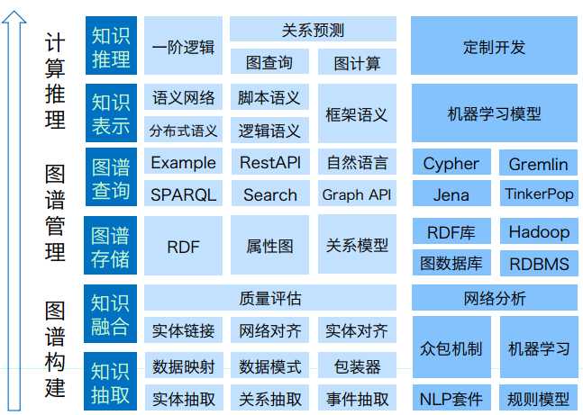
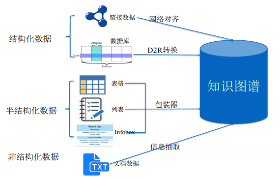

# KnowledgeGraph

<p align="center">
    
</p>


- ## 技术

  ```
  知识建模 / 知识获取 / 知识融合 / 知识存储 / 知识计算 / 知识应用
  图挖掘和图计算 / 可视化
  
  知识建模
  	确定节点 / 确定节点属性、标签 / 图设计 / 节点链接 / 动态事件描述
  	
  知识获取
      从结构化数据库中获取知识
      从链接数据中获取知识
      从半结构化数据中获取知识
      从文本中获取知识
      
  知识融合：数据模式层融合 / 数据层融合
  知识存储：三元组 ／　事件信息　／　时态信息
  知识计算：　图挖掘计算　／　本体推理　／　基于规则的推理
  图挖掘和图计算：图遍历　／　路径探寻　／　节点分析　／　族群分析　／　相似节点
  ```

  

  <p align="center">
  	
  </p>
  <h4 align="center">知识获取</h4>    

  

- ## 工具

  ```
  neo4j / orient DB / Titan / Flock DB / Allegro Graph
  D3.js / ECharts
  ```

  

- ## 应用

  ```
  问答
  搜索
  个性化推荐
  金融
  ```

  