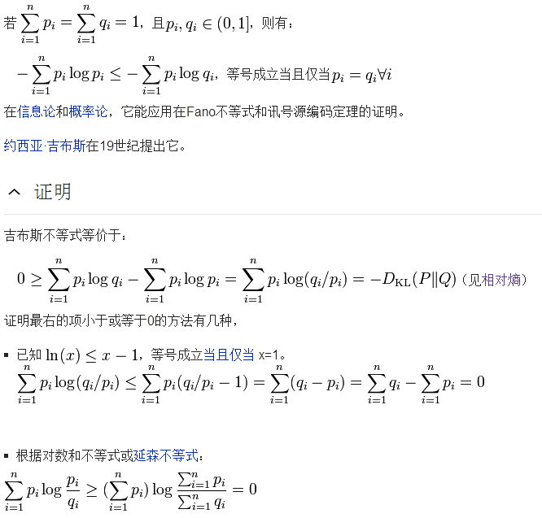
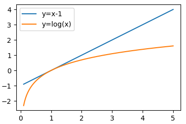

#### 1. Kullback-Leibler

$$
KL(p∣∣q)=−∫p(x)ln\frac{q(x)}{p(x)}dx≥−ln∫q(x)dx=-ln1=0
$$

#### 2. Jensen 不等式

函数的期望 >= 期望的函数
$$
f(E_z[ξ(z)])≤E_z[f(ξ(z))]\\

其中，f 为凸函数， f(\frac{x_1+x_2}{2})≤\frac{f(x_1)+f(x_2)}{2}
$$

#### 3. 不等式推导

$$将f() 替换为 -ln(),   \xi(z) 替换为 \frac{q(x)}{p(x)}$$
$$
E_x[f(ξ(x))]≥f(E_x[ξ(x)])\\

E_x[−ln\frac{q(x)}{p(x)}]≥−ln(E_x[\frac{q(x)}{p(x)}])\\

−∫p(x)ln\frac{q(x)}{p(x)}dx≥−ln∫p(x)\frac{q(x)}{p(x)}dx\\

−∫p(x)ln\frac{q(x)}{p(x)}dx≥−ln∫q(x)dx=0\\

KL(p∣∣q)≥04.
$$

#### 4. 吉布斯不等式

[reference](<https://www.cnblogs.com/hxsyl/p/4910218.html>)

