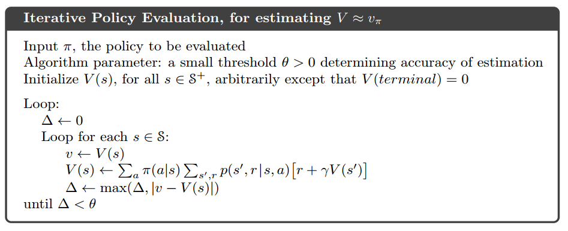
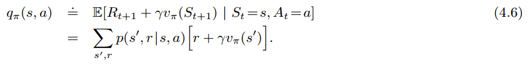
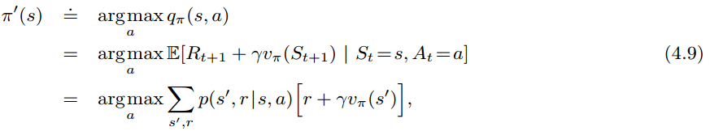
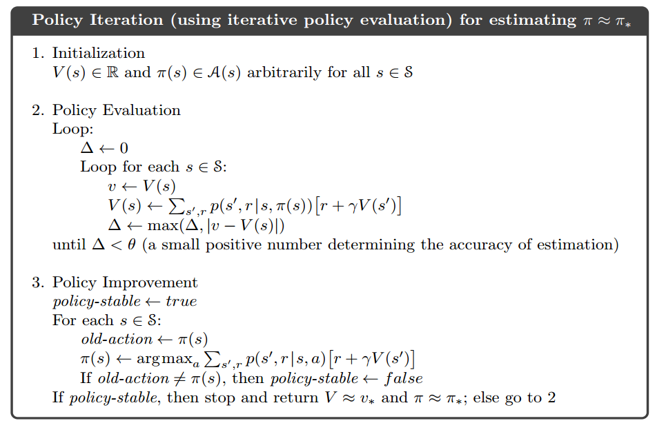
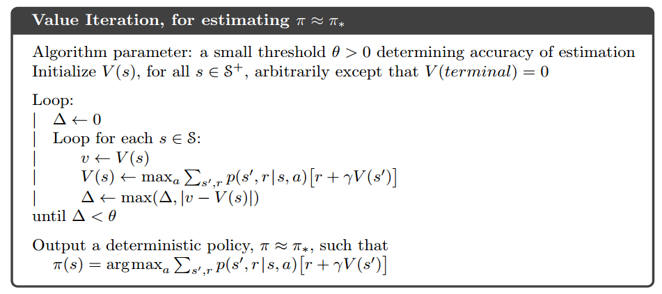

1. Policy Evaluation

   

    ```python
    # env.state: env 的所有状态
    # env.P[s][a]: env 处在状态 s 时，执行动作 a 后的状态及 reward 等信息
    # policy[s][a], s,a -> s', r
    # policy[s], 当前状态下所有可能的 action
    def policy_evaluation(env, policy, gamma=1.0, theta=1e-6):
        V = np.zeros(env.state)
        while True:
            delta = 0
            for s in env.state_space:
                v = 0
                for a, p_a in enumerate(policy[s]):
                    for p_s, s_, r, d in env.P[s][a]:
                        v += p_a * p_s * (r + gamma * V[s_])
                delta = max(delta, abs(V[s] - v))
                V[s] = v
            if delta < theta:
                break
        return V

    ```


2. Policy Improvement

    

    

    ```python
    def v2q(env, V, s, gamma=1.):
        q = np.zeros(env.action)
        for a in env.action_space:
            for p, s_, r, d in env.step(s, a):
                q[a] += p * (r + gamma * V[s_])
        return q
        
    def policy_improvement(env, V, gamma=1.):
        policy = np.ones([env.state, env.action]) / env.action
        for s in env.state_space:
            q = v2q(env, V, s, gamma)
            # 1
            best_a = np.argmax(q)
            policy[s][best_a] = 1
            
        return policy
    ```


3. Policy Iteration

    

    ```python
    def policy_iteration(env, gamma=1., theta=1e-6):
        policy = np.ones([env.state, env.action]) / env.action
        while True:
            V = policy_evaluation(env, policy, gamma, theta)
            policy_n = policy_improvement(env, V)
            
            if (policy_n == policy).all():
                break
        	policy = copy.copy(policy_n)
        return policy, V
    ```


4. Value Iteration

    

    ```python
    def value_iteration(env, gamma=1., theta=1e-6):
        V = np.zeros(env.state)
        while True:
            delta = 0
            for s in env.state_space:
                v = V[s]
                V[s] = max(v2q(env, V, s, gamma))
                delta = max(delta, abs(V[s] - v))
            if delta < theta:
                break
        policy = policy_improvement(env, V, gamma)
        
        return policy, V
    ```


