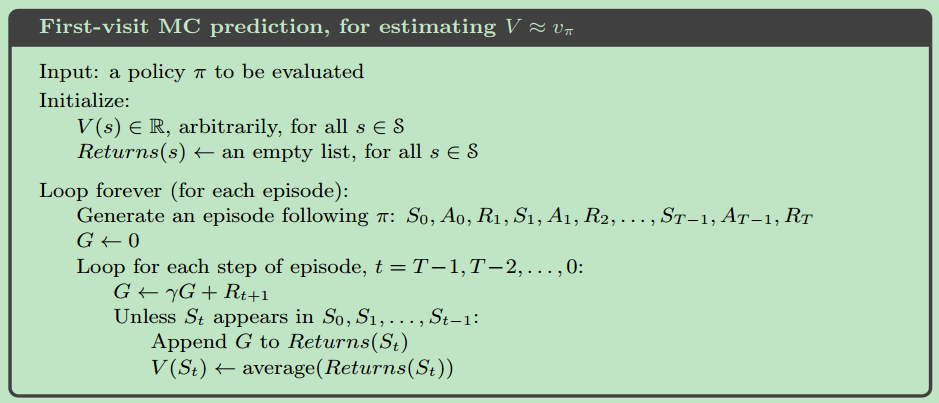
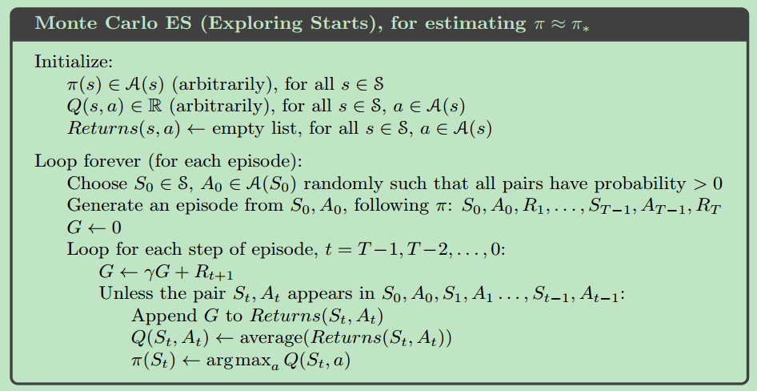
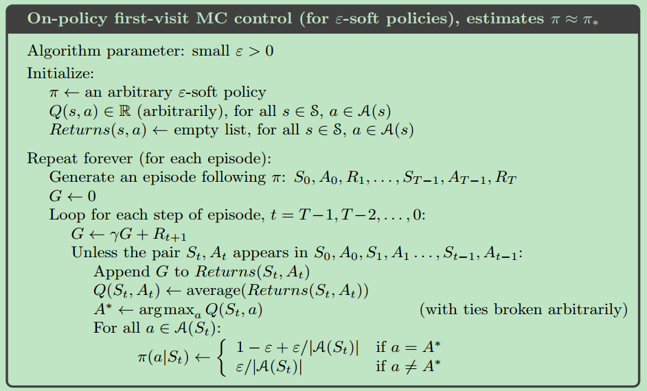
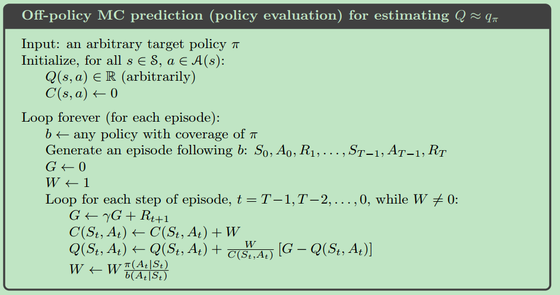
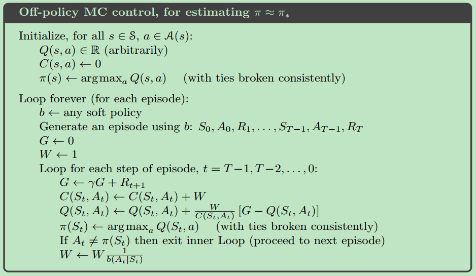

1. first-visit

   

   ```python
   # first-visit
   pi = init_pi()
   returns = defaultdict(list)
   while step < 1e6:
       episode = generate_epsiode(pi)
       G = np.zeros(|S|)  # 每个 state 只保留一个 G
       for (s, r) in reversed(epsiode):
           G[s] = gamma * G[s] + r
       for s in STATES:
           returns[s].append(G[s])
   V = {s: np.mean(r) for s, r in returns.items()}
   
   # every-visit
   G = 0
   for (s, r) in reversed(epsiode):
       G = gamma * G + r
       returns[s].append(G)
   ```

   

2. exploring starts

   

   ```python
   # exploring starts，假设所有的 (s, a) 都可以被选做初始状态
   def mc_prediction(env, num_episodes, generate_episode, gamma=1.0):
       # initialize empty dictionaries of arrays
       returns_sum = defaultdict(lambda: np.zeros(env.action_space.n))
       N = defaultdict(lambda: np.zeros(env.action_space.n))
       Q = defaultdict(lambda: np.zeros(env.action_space.n))
       # loop over episodes
       for _ in range(1, num_episodes + 1):
           episode = generate_episode(env)
           G = 0
           for (s, a, r) in reversed(episode):
               G = gamma * G + r
               returns_sum[s][a] += G
               N[s][a] += 1
   
       # for s in env.observation_space:
       #     for a in env.action_space:
               Q[s][a] = returns_sum[s][a] / N[s][a]
   
       return Q
   ```


```python
前面的 mc 算法中包含两个假设
1. 有无限个 episode，这样根据大数定律可知 V/Q 会收敛到期望值
2. 假设了 exploring starts, 即所有的 (s, a) 均可作为起始状态

对于假设 1, 
  (1) 尽可能多的生成 episode，当 V 的两次估计值小于 theta 时，便认为收敛
  (2) 使用 value iteration
对于假设 2, on-policy / off-policy

因为使用了 exploring starts, 在 (s, a) 初始条件下，其可以一直到 episode 结束（意味着有一个完整的 episode），在算法收敛及大数定律的条件下，我们得到的 V/Q 的最优的，所以可以直接用 greedy 来得到最优策略, 若是去掉这个 exploring starts，则 greedy 选择到的就不一定是最优的策略的，所以可使用 e-greedy 来代替
```


3. on-policy mc control

   
   
   ```python

   ```


4. off-policy mc prediction

   


5. off-policy mc control

   

   ```python
   
   ```

   

