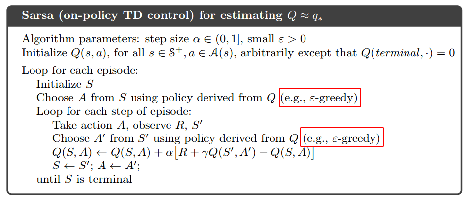
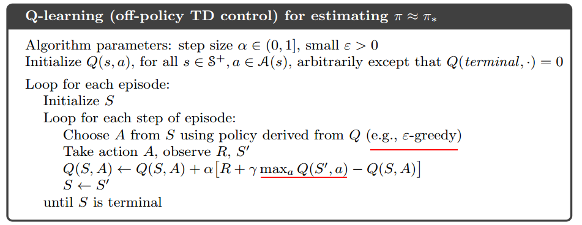
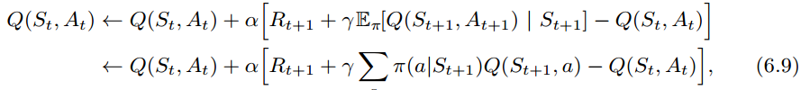
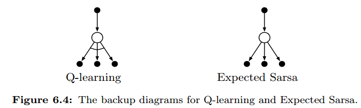

1. SARSA

   

   ```python
   def epsilon_greedy(Q, state, nA, eps):
       if np.random.rand() > eps: 
           return np.argmax(Q[state])
       else: 
           return env.action_space.sample()
       
   def sarsa(env, num_episodes, alpha, gamma=1.0):
       nA = env.action_space.n
       Q = defaultdict(lambda: np.zeros(env.nA))
       for i_episode in tqdm(range(1, num_episodes+1)):
           eps = max(1.0 / i_episode, 0.05) 
           
           state = env.reset()              
           action = epsilon_greedy(Q, state, nA, eps) 
           while True:
               next_state, reward, done, info = env.step(action)
               if done:
                   Q[state][action] += alpha * (reward + gamma * 0 - Q[state][action])
                   break
               else:
                   next_action = epsilon_greedy(Q, next_state, nA, eps) 
                   Q[state][a] += alpha * (reward + gamma * Q[next_state][next_action] - Q[state][action])
                   state = next_state     # S <- S'
                   action = next_action   # A <- A'
       return Q
   ```

   

2. Q-learning

   

   ```python
   state = env.reset()
   while True:
       action = epsilon_greedy(Q, state, nA, eps)
       next_state, reward, done, info = env.step(action)
       if done:
          Q[state][action] += alpha * (r + gamma * 0 - Q[state][action])
          break
       else:
          Q[state][action] += alpha * (r + gamma * np.max(Q[next_state]) - Q[state][action])
       state = next_state
   ```

   

3. expected-sarsa

   

   

   ```python
   state = env.reset()
   while True:
       action = epsilon_greedy(Q, state, nA, eps)
       next_state, reward, done, info = env.step(action)

       p = np.ones(nA) * eps / nA
       p[np.argmax(Q[next_state])] = 1 - eps + eps / nA
       Q_sum = np.dot(Q[next_state], p)

       Q[state][action] += alpha * (r + gamma * Q_sum - Q[state][action])
       state = next_state
       if done:
          break
   ```

